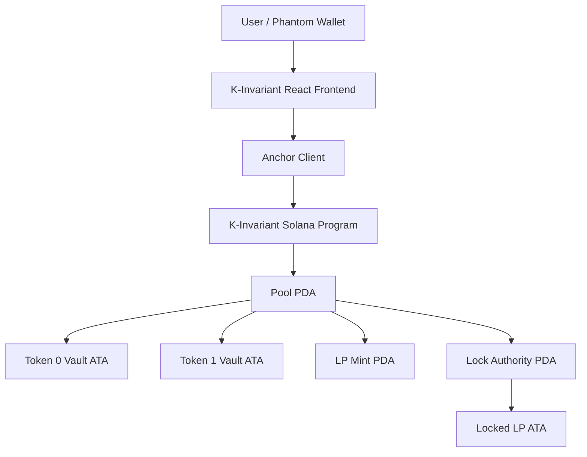

# K-Invariant

**Production-Oriented Constant Product AMM on Solana**

K-Invariant is a constant-product automated market maker built from the ground up using Rust, Anchor, SPL Token, React, and TypeScript.

The project focuses on deterministic account architecture, explicit liquidity accounting, slippage protection, security-oriented validation, and end-to-end Devnet execution.

## Live Application

**K-Invariant Devnet App**

https://k-invariant.vercel.app/

> The application currently operates on **Solana Devnet**.

---

## Overview

K-Invariant implements a traditional constant-product AMM:

```text
x × y = k
````

where:

```text
x = Token 0 reserve
y = Token 1 reserve
k = constant-product invariant
```

Users can:

* create permissionless token-pair pools
* provide initial liquidity
* provide subsequent optimal liquidity
* swap between pool assets
* remove liquidity
* receive and burn LP tokens
* view live reserves and wallet balances
* interact through Phantom
* inspect transactions on Solana Explorer

The protocol is intentionally built around simple, explicit invariants rather than hiding core AMM behavior behind abstractions.

---

# Live Devnet Deployment

## Program ID

```text
HVyRymResYhpSjAeLfQcabBTD8s15uXVzGZJUH5HjDHC
```

## Network

```text
Solana Devnet
```

The deployed program currently remains **upgradeable** while development and review continue.

---

# Architecture



The frontend never acts as the source of truth for protocol state.

Critical validation and accounting are enforced on-chain.

---

# Protocol Design

## Canonical Mint Ordering

Each pool stores its token pair in deterministic order.

Before pool creation:

```text
mint_a
mint_b
```

are sorted by public-key byte ordering into:

```text
token_0
token_1
```

This prevents duplicate pools such as:

```text
A/B
B/A
```

from representing the same pair.

---

## Deterministic Pool PDA

Each pair has exactly one canonical Pool PDA:

```text
[
    "pool",
    token_0,
    token_1
]
```

Conceptually:

```text
Pool PDA =
PDA("pool", token_0, token_1)
```

This gives each token pair one deterministic pool identity.

---

## Canonical Vaults

Each pool uses canonical Associated Token Accounts owned by the Pool PDA:

```text
vault_0 = ATA(pool, token_0)

vault_1 = ATA(pool, token_1)
```

The protocol validates these accounts on-chain rather than accepting arbitrary token accounts supplied by clients.

---

## LP Mint

Each pool has a deterministic LP mint:

```text
[
    "lp_mint",
    pool
]
```

The Pool PDA acts as the LP mint authority.

LP token decimals:

```text
9
```

---

# Minimum Liquidity Lock

Initial liquidity uses:

```text
MINIMUM_LIQUIDITY = 1,000 raw LP units
```

The first provider does not receive the entire initial LP supply.

Instead:

```text
total_lp =
floor(sqrt(amount_0 × amount_1))

provider_lp =
total_lp - MINIMUM_LIQUIDITY
```

The locked portion is minted to a canonical token account owned by:

```text
PDA("lock_authority", pool)
```

This reduces the effectiveness of first-depositor share-inflation attacks.

Because the deployed program is currently upgradeable, this liquidity should be described as:

```text
locked by the current program
```

rather than cryptographically permanent.

---

# Initial Liquidity

The first liquidity provider establishes the initial reserve ratio.

For:

```text
amount_0
amount_1
```

the initial LP supply is:

```text
LP_total =
floor(sqrt(amount_0 × amount_1))
```

The provider receives:

```text
LP_provider =
LP_total - MINIMUM_LIQUIDITY
```

The minimum-liquidity portion is sent to the lock account.

---

# Subsequent Liquidity

K-Invariant originally required deposits to satisfy an exact integer reserve ratio.

That design was later replaced after Devnet/frontend testing exposed a practical limitation: post-swap reserves can become relatively prime, making small exact-ratio deposits impossible.

The current implementation treats the supplied token amounts as **maximum desired amounts**.

For:

```text
amount_0_desired
amount_1_desired
```

the protocol calculates:

```text
lp_from_0 =
floor(
    amount_0_desired × lp_supply
    / reserve_0
)

lp_from_1 =
floor(
    amount_1_desired × lp_supply
    / reserve_1
)
```

The limiting asset determines the LP amount:

```text
lp_minted =
min(lp_from_0, lp_from_1)
```

The actual token amounts are calculated using ceiling division:

```text
amount_0_used =
ceil(
    lp_minted × reserve_0
    / lp_supply
)

amount_1_used =
ceil(
    lp_minted × reserve_1
    / lp_supply
)
```

The protocol guarantees:

```text
amount_0_used <= amount_0_desired

amount_1_used <= amount_1_desired
```

This allows users to provide practical liquidity amounts while preserving proportional LP accounting.

---

# Add-Liquidity Slippage Protection

The current instruction accepts:

```text
amount_0_desired
amount_1_desired

minimum_amount_0
minimum_amount_1

minimum_lp_out
```

The desired amounts cap the user's maximum spend.

The minimum token amounts protect against unexpected reserve-ratio movement.

The minimum LP output protects the user's expected ownership share.

---

# Swap Model

K-Invariant implements exact-input swaps.

For an input amount:

```text
amount_in
```

the swap fee is:

```text
fee =
floor(
    amount_in × fee_bps
    / 10,000
)
```

Current fee:

```text
30 basis points
= 0.30%
```

The pricing input is:

```text
amount_in_after_fee =
amount_in - fee
```

The constant-product output is:

```text
amount_out =
floor(
    reserve_out × amount_in_after_fee
    /
    (reserve_in + amount_in_after_fee)
)
```

The entire input amount enters the input vault.

The fee remains inside the pool, increasing value for LPs.

---

# Swap Slippage Protection

Every swap accepts:

```text
minimum_amount_out
```

Execution succeeds only if:

```text
actual_amount_out >= minimum_amount_out
```

This protects users against unfavorable reserve changes between quote generation and transaction execution.

---

# Remove Liquidity

Removing liquidity burns LP tokens and returns a proportional share of both reserves.

For:

```text
lp_to_burn
```

the protocol computes:

```text
amount_0_out =
floor(
    reserve_0 × lp_to_burn
    / lp_supply
)

amount_1_out =
floor(
    reserve_1 × lp_to_burn
    / lp_supply
)
```

Users provide:

```text
minimum_amount_0_out
minimum_amount_1_out
```

to protect both withdrawal outputs.

The locked minimum LP remains outside the provider's redeemable balance.

---

# Token Requirements

K-Invariant currently supports the legacy SPL Token Program.

Pool initialization requires both external token mints to have:

```text
mint_authority = None

freeze_authority = None
```

This prevents pool assets from being arbitrarily inflated or frozen after pool creation.

Token-2022 is intentionally not supported in the current version.

---

# Security-Oriented Design

K-Invariant includes protections for several protocol and Solana-specific failure modes.

## Canonical account validation

The program validates:

* canonical Pool PDA
* canonical vault ATAs
* canonical LP mint
* canonical locked LP account
* token mint relationships
* pool/mint relationships

---

## Account substitution protection

Tests verify rejection of:

* attacker-created vault accounts
* non-canonical token accounts pretending to be vaults
* fake LP token substitution
* accounts belonging to another legitimate pool

---

## Arithmetic safety

AMM math uses:

```text
u64 public values
u128 intermediate calculations
```

Conversions back to `u64` are checked.

The protocol avoids floating-point arithmetic.

---

## Integer square root

Initial LP calculation uses deterministic integer square root rather than floating-point arithmetic.

---

## Ceiling division

Optimal liquidity uses ceiling division for actual token consumption.

This prevents LP shares from being minted against token amounts rounded downward below the proportional requirement.

---

## Minimum-liquidity lock

The first provider cannot receive the entire LP supply.

A minimum LP amount is locked by the current program to reduce first-depositor share-manipulation risk.

---

## Donation handling

Tokens transferred directly to pool vaults are treated as donations.

Vault balances and LP mint supply remain the dynamic source of truth rather than cached reserve values in Pool state.

---

# Pool State

The Pool account intentionally stores very little state.

Conceptually:

```text
Pool {
    token_0
    token_1
    bump
}
```

Reserve balances are read directly from SPL Token vault accounts.

LP supply is read directly from the LP mint.

This avoids maintaining duplicate reserve/supply bookkeeping.

---

# Frontend

The K-Invariant frontend is built with:

* React
* TypeScript
* Vite
* Anchor TypeScript client
* Solana Web3.js
* SPL Token JavaScript SDK
* Solana Wallet Adapter

---

# Frontend Features

The public interface supports:

### Pools

* discover existing pools
* validate legacy SPL token mints
* canonicalize mint ordering
* derive deterministic Pool PDA
* detect existing pools
* create permissionless pools

### Swap

* live reserve reads
* live wallet balances
* Token 0 → Token 1 swaps
* Token 1 → Token 0 swaps
* fee calculation
* price-impact estimation
* minimum received calculation
* Phantom transaction signing
* Explorer links

### Liquidity

* initial liquidity
* optimal subsequent liquidity
* automatic counterpart calculation
* actual token consumption preview
* LP output preview
* LP supply display
* user LP balance
* liquidity removal
* withdrawal minimums
* live state refresh

---

# Frontend Deployment

The K-Invariant frontend is deployed on Vercel:

```text
https://k-invariant.vercel.app/
```

The public deployment connects to:

```text
Solana Devnet
```

---

# Testing

The project contains multiple testing layers.

## Rust AMM Math

```text
65 tests passing
```

Coverage includes:

* fee calculation
* integer square root
* initial liquidity
* optimal subsequent liquidity
* limiting-asset selection
* ceiling rounding
* liquidity withdrawal
* swap calculations
* zero-value rejection
* overflow-sensitive cases
* large-value arithmetic

Run:

```bash
cargo test -p amm-math
```

---

## Anchor Integration Tests

```text
44 tests passing
```

Coverage includes:

* pool initialization
* mint validation
* canonical vault creation
* LP mint creation
* minimum-liquidity locking
* initial liquidity
* optimal subsequent liquidity
* desired-amount behavior
* liquidity minimums
* swap execution
* reverse swaps
* minimum-output rejection
* remove liquidity
* account substitution attacks
* fake LP attacks
* cross-pool account substitution

Run:

```bash
anchor test
```

---

# Devnet Smoke Test

A separate Devnet smoke script validates the deployed program against the real Solana Devnet.

It executes:

```text
initialize_pool
      ↓
add_liquidity
      ↓
swap
      ↓
remove_liquidity
```

Run:

```bash
ANCHOR_PROVIDER_URL=https://api.devnet.solana.com \
ANCHOR_WALLET=$HOME/.config/solana/id.json \
yarn ts-mocha \
  -p ./tsconfig.json \
  -t 1000000 \
  scripts/devnet-smoke.ts
```

The Devnet smoke test has successfully completed the full protocol lifecycle.

---

# Repository Structure

```text
production-amm/
│
├── amm-math/
│   └── src/
│       ├── error.rs
│       ├── fees.rs
│       ├── integer_sqrt.rs
│       ├── liquidity.rs
│       ├── swap.rs
│       └── lib.rs
│
├── programs/
│   └── production-amm/
│       └── src/
│           └── lib.rs
│
├── tests/
│   ├── account-substitution.ts
│   ├── add-liquidity.ts
│   ├── remove-liquidity.ts
│   └── swap.ts
│
├── scripts/
│   └── devnet-smoke.ts
│
├── frontend/
│   ├── src/
│   │   ├── amm/
│   │   ├── components/
│   │   ├── hooks/
│   │   ├── idl/
│   │   └── pages/
│   │
│   └── README.md
│
├── Anchor.toml
├── Cargo.toml
└── README.md
```

---

# Local Development

## Prerequisites

The project requires:

```text
Rust
Cargo
Solana CLI
Anchor
Node.js
Yarn
```

The project was developed against:

```text
Anchor 0.32.1
```

---

## Clone

```bash
git clone https://github.com/Sathwiksaibogi/production-amm.git

cd production-amm
```

---

## Install Root Dependencies

```bash
yarn install
```

---

## Build the Program

```bash
anchor build
```

---

## Run AMM Math Tests

```bash
cargo test -p amm-math
```

---

## Run Anchor Integration Tests

```bash
anchor test
```

---

# Frontend Development

```bash
cd frontend

yarn install
```

Create:

```text
.env
```

from:

```bash
cp .env.example .env
```

Example:

```env
VITE_SOLANA_RPC_URL=https://api.devnet.solana.com

VITE_AMM_PROGRAM_ID=HVyRymResYhpSjAeLfQcabBTD8s15uXVzGZJUH5HjDHC

VITE_DEFAULT_POOL=GrxzGzcDGLvpYq1YsbF4FkDhNUSEWvhxHVkoVqP8MeYk
```

Start development:

```bash
yarn dev
```

Build for production:

```bash
yarn build
```

---

# Design Decisions

Several parts of the protocol are intentionally simple.

## One pool per pair

K-Invariant currently allows one canonical pool per token pair.

There are no fee tiers in v1.

---

## Fixed swap fee

```text
30 bps
```

The fee is protocol-wide rather than configurable per pool.

---

## Permissionless pool creation

Any user may initialize a pool for an eligible token pair.

---

## No administrative reserve accounting

The protocol reads actual vault balances rather than storing reserve snapshots.

---

## Legacy SPL Token only

Token-2022 extensions are deliberately excluded from the current threat model.

---

# Known Limitations

K-Invariant is production-oriented but **not mainnet production-ready**.

Current limitations include:

* no independent security audit
* upgrade authority remains active
* public Devnet RPC may rate-limit requests
* no Token-2022 support
* no routing across multiple pools
* no multi-hop swaps
* no fee tiers
* no protocol fee
* no concentrated liquidity
* no formal verification
* no property-based/fuzz testing yet
* no oracle integration
* no frontend automated test suite yet

These limitations are intentional areas for future engineering rather than hidden assumptions.

---

# Security Status

The project has extensive unit, integration, adversarial account-substitution, Devnet, and manual browser testing.

However:

> **K-Invariant has not undergone an independent professional security audit.**

It should not be used with valuable mainnet assets in its current state.

---

# Project Status

```text
AMM math                     ✅
Anchor program                ✅
Canonical pool architecture   ✅
Security hardening            ✅
65 Rust tests                 ✅
44 Anchor tests               ✅
Devnet deployment             ✅
Devnet smoke test             ✅
Phantom integration           ✅
Permissionless pool creation  ✅
Swaps                         ✅
Initial liquidity             ✅
Optimal liquidity             ✅
Liquidity removal             ✅
React frontend                ✅
Vercel deployment             ✅
Independent audit             ❌
Mainnet deployment            ❌
```

K-Invariant is currently a **Devnet-tested protocol engineering project focused on Solana, Rust, AMM design, and smart-contract security**.

---

## Disclaimer

K-Invariant is an educational and protocol-engineering project.

It is not audited financial infrastructure and should not be relied upon for production mainnet assets without further review, testing, and independent security assessment.

````
